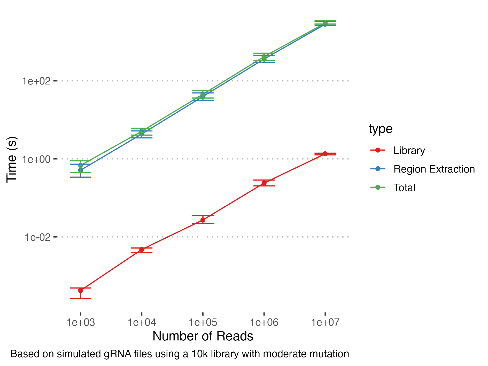
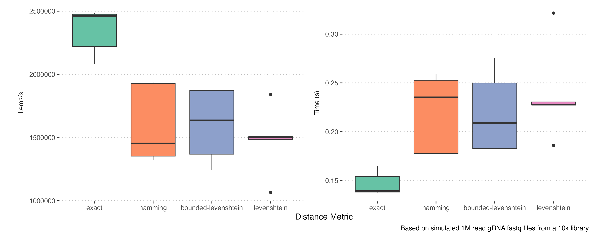
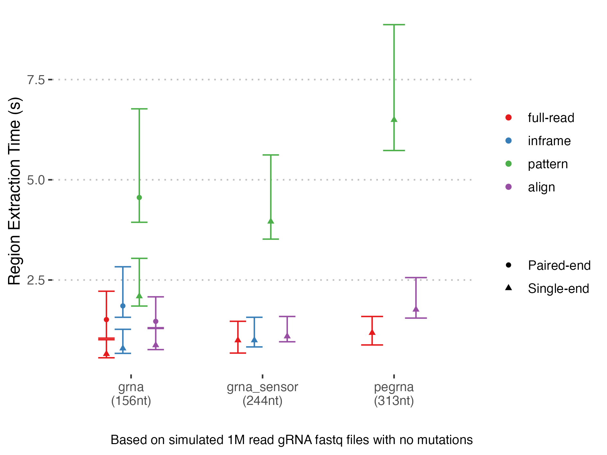
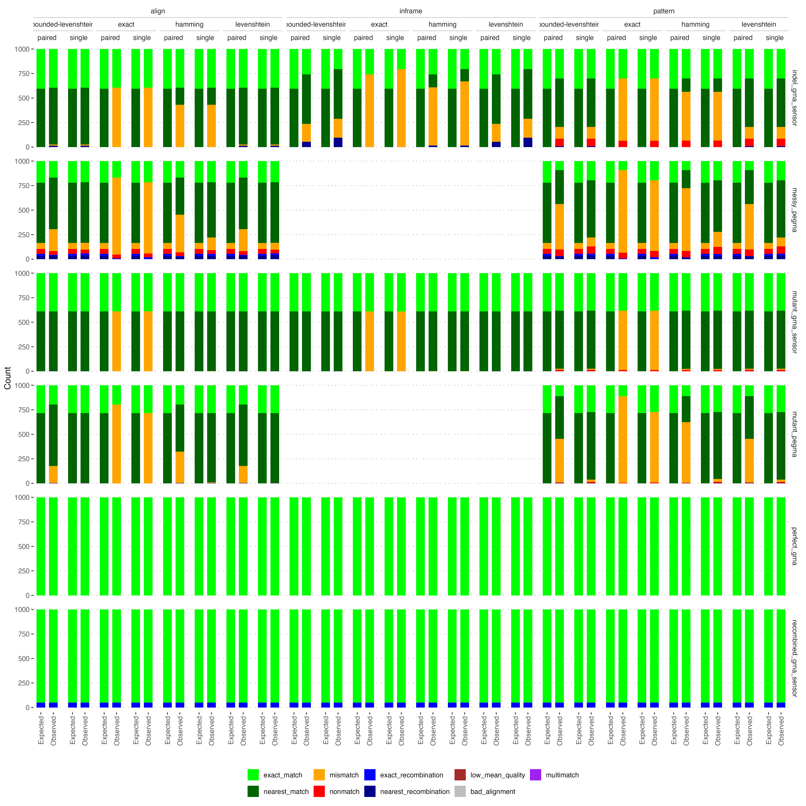

# DNAComb: parsing, counting and library comparison for structured sequence reads


CLI tool for counting structured single and paired end sequencing reads and comparing them to an expected library.
It compares each read to a canonical form defined in a library specification using one of four approaches:

* Alignment - Align reads to the template via semi-global alignment. Most thorough but slowest, allows variable region lengths
* Pattern matching - Use flanking regions to identify regions. Faster than alignment while allowing variable region length but less robust against variation. All regions are considered until one is identified and then subsequent regions must be found in turn, with missing regions leading to all subsequent ones ignored too. In future we may make a more flexible pattern matching option but for now if use alignment for comprehensive matching.
* Inframe - Assume regions occur at the correct position in reads (for instance after using cutadapt). Fastest structured read counting but can't handle variation.
* Raw - Count full length sequences, fastest but unstructured

These are suitable for different scenarios, with pattern matching being a sensible default choice as it balances speed and robustness.

Once regions of interest are extracted they can be compared to an expected library using exact matching, Hamming or (potentially bounded) Levenshtein distance and the counts reported in several outputs:

* `{prefix}.counts.tsv` - Counts of each region combination
* `{prefix}.library_counts.tsv` - Inferred counts of each library element in all combinations
* `{prefix}.summary.tsv` - Summary counts of different types of reads (matches, mismatches, recombinations, etc.)

## Installation

After installing the [Rust toolchain](https://www.rust-lang.org/tools/install) you have two choices - download from Crates.io or manual installation.
Using Crates.io is much simpler:

```bash
cargo install dnacomb
```

Alternatively, to manually install:

1. Clone the repo `git clone git@github.com/allydunham/dnacomb.git` (of `git clone https://github.com/allydunham/dnacomb`)
2. `cd dnacomb`
3. Install the package with `cargo install --path .` or build locally using `cargo build`

You can build in dev (`cargo build`) or release mode (`cargo build --release`) for more control - release mode, which is the default for `install` is more optimised but reports fewer logging messages by default and disables some very low level logging completely. After building the compiled comb binary can be found in `target/debug` or `target/release`.

### SIMD Acceleration

Optional SIMD accelerated library comparison is included, using accelerated functions for distance metric calculation. This may somewhat speed up library comparison on compatible architecture (although my results have been modest). Compile with `RUSTFLAGS='-C target-feature=+avx2,+sse4_2'` to enable SIMD builds. The resulting build is also safe to use on non-SIMD architectures and will report whether SIMD is enabled and compatible hardware detected, however it is slightly suboptimal to include if you don't use it as a runtime check has to be performed before each distance calculation.

## Usage

Full CLI usage is described in the help text (`dnacomb -h` or `dnacomb --help`), with the core options listed below:

```text
Usage: dnacomb [OPTIONS] <FORWARD> [REVERSE]

Arguments:
  <FORWARD>  Forward reads in Fasta or Fastq format
  [REVERSE]  Reverse reads in Fasta or Fastq format

Input/Output:
  -l, --library-spec <LIBRARY_SPEC>  Path to JSON file defining the library specification
  -o, --output <OUTPUT>  Prefix for output TSV files [default: read_counts]

Counting:
  -m, --mode <MODE>    Method for extracting regions of interest [default: align] [possible values: full-read, inframe, pattern, align]
  -g, --group <GROUP>  Group counts by applying this capture group regex to forward read names and extracting the first capture group match

Library Comparison:
  -c, --library-counts                     Calculate similarity to oligo library and output an additional table of library counts
  -d, --distance-metric <DISTANCE_METRIC>  Distance metric to use for library comparison.

Filtering:
  -q, --mean-quality-threshold <MEAN_QUALITY_THRESHOLD>  Filter reads with mean Phred score below this threshold
  -r, --alignment-tolerance <ALIGNMENT_TOLERANCE>        Minimum proportion of expected alignment score to keep
```

More details on the internals and interface can also be found in the [documentation](https://github.com/allydunham/dnacomb).

## Inputs

### Sequence Files

Sequence data can be read from single and paired end fasta and fastq formatted files.
By default the format is identified automatically based on the extension but can also be manually overridden if necessary.
Pairs don't necessarily have to both be fasta or fastq, although not matching would be an unusual use case with fasta bases assigned a default quality score.
Gzip compression is also accepted and generally automatically detected.

### LibSpec

Library specifications are a JSON file consisting of meta-data and a series of regions that define the expected read.
Several examples can be found in `config/`
In general it has the form:

```JSON
{
    "id": "Name", // Unused, just for info
    "forward_start_region": "{region_id}", // Start region for forward reads, used for inframe extraction
    "forward_read_length": 150, // Expected read length
    "reverse_start_region": "{region_id}", // Equivalent for reverse reads
    "reverse_read_length": 150,// Expected read length
    "regions": [ // Array of region objects, with two seq_types currently supported. A variable region must be flanked by fixed regions to allow regions to be extracted
        {
            "id": "name1", // Region name
            "seq_type": "Library", // Library type, will be compared to the expected library
            "min_length": X, // Min/max expected lengths
            "max_length": Y,
            "max_distance": 2 // Maximum number of mismatches allowed to still be considered a match
        },
        {
            "id": "name2", // Region name
            "seq": "[ACTG]", // Fixed sequence
            "seq_type": "Fixed", // A fixed region, anchors variable regions to allow identification
            "length": 86 // Length, must be the length of seq
        },
    ],
    "library": "path/to/library.tsv" // Path to a TSV file describing the library
}
```

### Library TSV

Library TSV files are strictly tab-separated with one column per region you want to run library comparison for.
This doesn't have to include all variable regions, for instance if you have a barcode with no expectation on association.
Each row contains an expected sequence combination.
A special column named `_id` can be used to associate a name with each library member, which will be used in the output table in place of it's numeric index (this means `_id` should be avoided as a region name).
Examples are again found in `config/` matching the LibSpec JSONs.

## Outputs

DNAComb produces up to three outputs, depending on configuration, which detail the full count table for observed region combinations, counts that can be allocated to library members and a summary table of match categories.

### Full Counts

This TSV file contains the full count data in the following columns:

* `group` - The read group reads have been assigned to, for instance cell barcodes in single cell experiments.
* For each region of interest:
  * `{id}` - The observed region sequence. ^ indicates potential truncation at either end.
  * `{id}_nearest` - The closest match from the library, if any. Equivalent matches are listed as a comma separated list.
  * `{id}_distance` - The distance to the library match, with interpretation varying depending on distance metric used.
  * `{id}_n_matches` - The number of library matches found at that distance.
* `combination_status` - Flag determining whether the combination of regions occurs in the library.
* `combination_distance` - Total distance to the assigned library combination(s).
* `combinations_in_library` - How many library combinations match at this distance.
* `combination_indexes` - The index of the matching library combinations, as the row number of the library TSV
* `count` - The number of times this combination was observed

The possible combination statuses are:

* `Uncompared` - No library comparison performed
* `Match` - A unique match was found
* `MultiMatch` - Multiple equivalent matches found
* `Recombination` - All regions match the library but are in an unexpected combination
* `Mismatch` - At least one region has no match
* `Nonmatch` - Not all regions are present (e.g. a truncated or contaminant read)

### Library Counts

This TSV gives counts for each library combinations observed in the dataset, summarising the full count table.
It includes matches, mismatches & recombinations but sums over all reads with the same combination of library region assignments.
It contains the following columns:

* `group`
* `{id}`
* `combination_status`
* `combinations_in_library`
* `combination_indexes`
* `count`

They have the same interpretation as above apart from now the region ID columns correspond to library sequences rather than observed sequences.

### Summary Counts

Finally the summary counts TSV gives the count and proportion of reads from each combination status, as well as the count of reads that were filtered for each reason.
It contains the following columns:

* `group` - The category group (all, unfiltered or filtered)
* `metric` - The categories (e.g. `exact_match` for matches of 0 distance or `bad_alignment` for reads filtered as poorly aligned)
* `count` - The number of reads
* `overall_proportion` - The proportion of all reads
* `group_proportion` - The proportion of reads in the same group

## Future Roadmap

A number of features are planned for the future, although there isn't a timeline for when they will be worked on or released.
If there are other features that would benefit you feel free to submit issues with suggestions.
We are also happy to accept pull requests with implementations or bug fixes although better to start with an issue to confirm the desired feature fits into the tool.

Currently planned features:

* More read filtering options
* LibSpec enhancements, including more meta data
* Multi-threading
* Mutant regions, for instance for regions covering an ORF that has an expected sequence with minor variations
* Reading Sam/Bam format files
* More handling of unexpected sequences, for instance identifying the observed recombination positions or outputting unexpected reads to file for analysis

## Tests and Benchmarks

Script for end to end tests and benchmarks are included in `scripts/`.
The test script runs the tool under a variety of conditions with simulated data and checks no errors occur, as well as writing the output to `tests/` for downstream correctness checks.
The benchmark script runs a variety of simulated read workloads, writing a summary TSV to `benchmark/benchmark.tsv`.
The results of both processes can be further analysed using the plotting R script to generate summary plots, with example plots found in `plots/`.
All scripts assume they are running from the project root.

Unit tests and unit benchmarks are also used to test individual functionality, although at present the coverage is fairly low.

### Performance

We generally see good performance, with reasonable computation times on most workflows we have attempted.
In general, larger sequence files and larger libraries lead to slower processing as expected.
This benchmark shows alignment performance for simulated fastq files at a range of read counts for 10k guide a gRNA library with spacer and barcode regions.
The mutation rate was sufficiently high that alignment caching didn't come into play - in real world examples with many repeated reads you would expect to see sub-linear scaling with read count.



The other key result is the trade-offs for different distance metrics and region extraction approaches:




Alignment is generally slower but gives more accurate results and the same is true for Levenshtein distance, although in that case Bounded-Levenshtein is much quicker and equivalent.
In this case alignment caching makes it competitive with other methods - how true this is will depend on the mutation rate and what proportion of reads are duplicated.
There is a slight caveat in that they both can paper over unexpected DNA events, particularly indels in your construct.
If you expect observed indels are likely real mutation rather than sequencing error then care must be taken with these approaches.

### Current limitations

The current methods are generally robust, with options available to deal with various levels of mutant sequences, however some methods having bigger limitations than others under particular mutational profiles.
We test this with an integration test on simulated data (see the `scripts/` and `plots/` folders), which gives this summary:



The different methods have the follow profiles:

* For unmutated sequences all methods give perfect counts as expected and alignment is generally robust across simulated mutations.
* The inframe matching approach is generally ok as long as region lengths don't vary and there aren't too many indels.
* Flanking pattern matching is robust under normal mutation profiles but breaks down under more extreme variants like indels in the flanking patterns. It also cannot cope with as wide a range of regions structures as full alignment.
* Full alignment is the most robust across error modes and region structures.

The distance metrics behave as expected, with exact matching missing and mutant sequences and hamming distance being much less robust than the Levenshtein variants.
Both flanking patterns and alignment can deal with variable length regions, including across the read junction in paired end matching but regions that cross reads are not always combined correctly.
If a variable regions spans both reads it's recommended to merge reads first where practical.

Additionally, the following bugs are currently known:

* Errors when sequences are 0 or 1bp long
