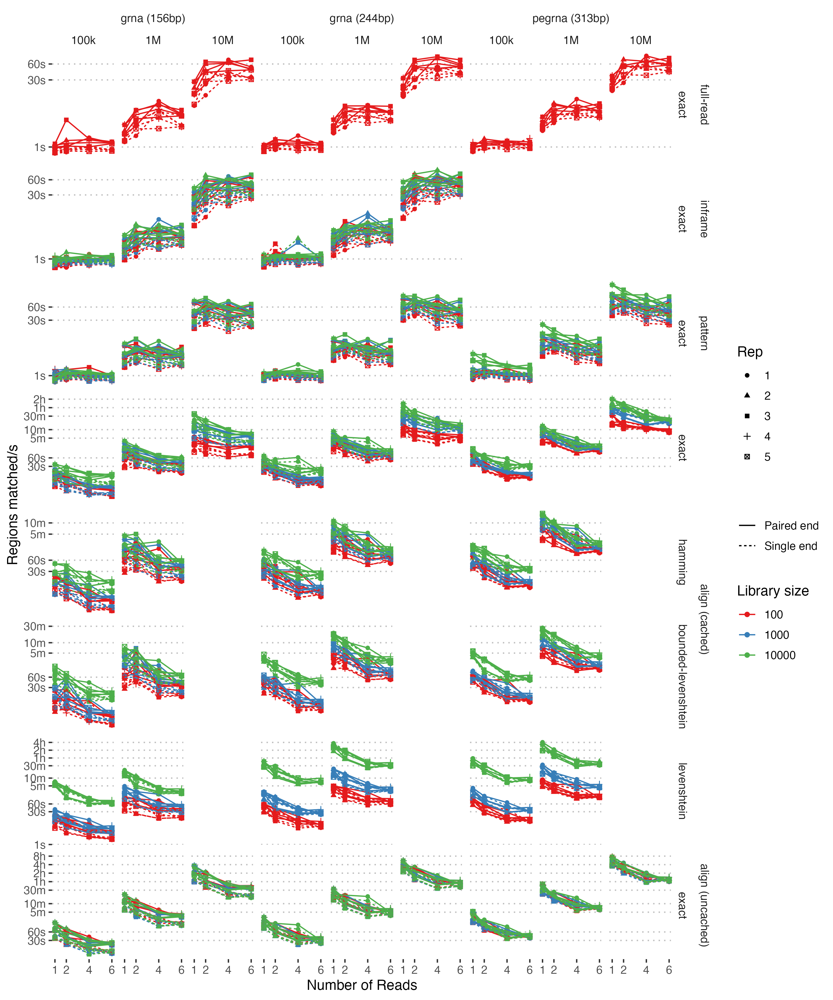

# DNAComb: parsing, counting and library comparison for structured sequence reads


CLI tool for processing single or paired-end Fasta/q sequencing reads with an expected internal structure, for instance fixed scaffold regions flanking variable barcodes, spacers, or other library elements as found in amplicon-like or construct-based sequencing assays.
DNAComb extracts the variable regions of interest and optionally compares them to one or more libraries of expected sequences, identifying matches (including near misses), mismatches, recombinations of library elements and unexpected sequence forms.

The overall workflow is:

1. Read Fasta/Fastq input files
2. Extract variable regions defined in a LibSpec JSON file
3. Optionally compare those observed regions to one or more expected library TSVs
4. Write TSV outputs describing observed combinations, inferred library assignments, summary counts, and filtered reads

Four region extraction algorithms are currently implemented:

* **Alignment**: Align reads to the template via semi-global alignment. This is the most robust option for most construct designs and the default mode. It handles variable-length regions and is the best choice when reads may contain substitutions or indels, but it is also the slowest by a significant margin. There are also constructs where robust alignment is difficult, even after tuning parameters, in which case pattern matching is generally a good alternative.
* **Pattern matching**: Identify variable regions using fixed flanking sequences from the constant regions. This is faster than alignment and still supports variable-length regions, but it is less robust when mutations occur in the flanking regions. Once a region is missed, downstream regions in the same read may also be missed.
* **Inframe**: Extract regions from their expected positions within the read. This is very fast, but it assumes reads are already in the expected frame and is only suitable when region lengths are fixed and read structure is well controlled.
* **full-read**: Count complete read sequences. This is the simplest and fastest mode but does not interpret internal structure.

These are suitable for different scenarios and read structures but a good rule of thumb would be:
* use `align` for more complex constructs and error prone sequencing where robustness matters most and compute time is not prohibitive
* use `pattern` for designs where alignment fails or to improve throughput for constructs with variable length regions of interest and accurate sequencing so you expect flanking patterns to be robust
* use `inframe` for rapid processing when you know good reads are the same length and in the same frame
* use `full-read` for simple tabulation and filtering

Once regions of interest are extracted they can be compared to an expected library using exact matching, Hamming or (potentially bounded) Levenshtein distance and the counts reported in several outputs:

* `{prefix}.counts.tsv` - Counts of each region combination
* `{prefix}.library_counts.tsv` - Inferred counts of each library element in all combinations
* `{prefix}.summary.tsv` - Summary counts of different types of reads (matches, mismatches, recombinations, etc.)
* `{prefix}.filtered.tsv` - filtered read counts for e.g. bad alignments, low quality, short reads

## Installation

After installing the [Rust toolchain](https://www.rust-lang.org/tools/install) you have two choices - download from Crates.io or manual installation.
Using Crates.io is much simpler:

```bash
cargo install dnacomb
```

Alternatively, to manually install:

1. Clone the repo `git clone git@github.com/allydunham/dnacomb.git` (of `git clone https://github.com/allydunham/dnacomb`)
2. `cd dnacomb`
3. Install the package with `cargo install --path .` or build locally using `cargo build`

You can build in dev (`cargo build`) or release mode (`cargo build --release`) for more control - release mode, which is the default for `install` is more optimised but reports fewer logging messages by default and disables some very low level logging completely. After building the compiled comb binary can be found in `target/debug` or `target/release`.

### SIMD Acceleration

Optional SIMD accelerated library comparison is included, using accelerated functions for distance metric calculation. This may somewhat speed up library comparison on compatible architecture (although my results have been modest). Compile with `RUSTFLAGS='-C target-feature=+avx2,+sse4_2'` to enable SIMD builds. The resulting build is also safe to use on non-SIMD architectures and will report whether SIMD is enabled and compatible hardware detected, however it is slightly suboptimal to include if you don't use it as a runtime check has to be performed before each distance calculation.

## Usage

Full CLI usage is described in the help text (`dnacomb -h` or `dnacomb --help`), with the core options listed below:

```text
Usage: dnacomb [OPTIONS] <FORWARD> [REVERSE]

Arguments:
  <FORWARD>  Forward reads in Fasta or Fastq format
  [REVERSE]  Reverse reads in Fasta or Fastq format

Input/Output:
  -l, --library-spec <LIBRARY_SPEC>  Path to JSON file defining the library specification
  -o, --output <OUTPUT>  Prefix for output TSV files [default: read_counts]

Counting:
  -m, --mode <MODE>    Method for extracting regions of interest [default: align] [possible values: full-read, inframe, pattern, align]
  -g, --group <GROUP>  Group counts by applying this capture group regex to forward read names and extracting the first capture group match

Library Comparison:
  -c, --library <LIBRARY>...               Calculate similarity to oligo library(s) and output an additional table of library counts
  -d, --distance-metric <DISTANCE_METRIC>  Distance metric to use for library comparison.

Filtering:
  -q, --mean-quality-threshold <MEAN_QUALITY_THRESHOLD>  Filter reads with mean Phred score below this threshold
  -r, --alignment-tolerance <ALIGNMENT_TOLERANCE>        Minimum proportion of expected alignment score to keep

Technical:
  -T, --threads <THREADS>              Number of threads to use [default: 1]
```

The inputs and outputs are described below.
We have also developed a [companion Nextflow pipeline](https://github.com/allydunham/dnacomb_pipeline) managing processing of raw sequence reads into count tables, making it easier to process many samples in parallel, particularly on HPC systems.

The package can also be used programmatically in your own Rust programs (or via e.g. Python if you build a wrapper library), but this is less well supported and tested.
More details on the package internals and library interface can be found on [docs.rs](https://docs.rs/dnacomb/latest/dnacomb/).

### Minimal examples

Count structured reads without library comparison:

```bash
dnacomb \
  --library-spec config/example_libspec.json \
  --mode align \
  --output results/sample1 \
  reads_R1.fastq.gz reads_R2.fastq.gz
```

Count reads and compare observed regions to an expected library:

```bash
dnacomb \
  --library-spec config/example_libspec.json \
  --library config/example_library.tsv \
  --distance-metric hamming \
  --mode align \
  --output results/sample1 \
  reads_R1.fastq.gz reads_R2.fastq.gz
```

Count reads with a combinatorial library design:

```bash
dnacomb \
  --library-spec config/example_libspec.json \
  --library config/pegrna_spacer.tsv config/pegrna_target.tsv \
  --distance-metric bounded-levenshtein \
  --mode pattern \
  --output results/sample1 \
  reads_R1.fastq.gz reads_R2.fastq.gz
```

Count reads grouped by a regex extracted from forward read names:

```bash
dnacomb \
  --library-spec config/example_libspec.json \
  --group 'cell=([A-Za-z0-9_-]+)' \
  --output results/sample1 \
  reads_R1.fastq.gz reads_R2.fastq.gz
```

## Inputs

### Sequence Files

Sequence data can be read from single and paired end Fasta and Fastq formatted files.
By default the format is identified automatically based on the extension but can also be manually overridden if necessary.
Pairs don't necessarily have to both be Fasta or Fastq, although not matching would be an unusual use case with Fasta bases assigned a default quality score.
Gzip compression is also accepted and generally automatically detected.

### LibSpec

A LibSpec is a JSON file describing the expected structure of the sequenced construct and the expected sequencing parameters (these can be overridden in the CLI input).
A sequence is described as a series of regions which can currently be of two types:

- **Fixed** regions: expected constant sequence, used as anchors for region extraction.
- **Library** regions: variable regions of interest, such as barcodes or spacers, which may later be compared to an expected library.

Variable regions should generally be separated by fixed regions, particularly when they are variable length as is impossible to determine where two variable length regions meet without an anchor inbetween.
Pattern matching in particular strictly depends on reliable flanking fixed sequence.

Several examples can be found in `config/`
In general it has the form:

```text
{
    "id": "Name", // Unused, just for info
    "forward_start_region": "{region_id}", // Start region for forward reads, used for inframe extraction
    "forward_read_length": 150, // Expected read length
    "reverse_start_region": "{region_id}", // Equivalent for reverse reads
    "reverse_read_length": 150,// Expected read length
    "regions": [ // Array of region objects, with two seq_types currently supported. A variable region must be flanked by fixed regions to allow regions to be extracted
        {
            "id": "name1", // Region name
            "seq_type": "Library", // Library type, will be compared to the expected library
            "min_length": X, // Min/max expected lengths
            "max_length": Y,
            "max_distance": 2 // Maximum number of mismatches allowed to still be considered a match
        },
        {
            "id": "name2", // Region name
            "seq": "[ACTG]", // Fixed sequence
            "seq_type": "Fixed", // A fixed region, anchors variable regions to allow identification
            "length": 86 // Length, must be the length of seq
        },
    ]
}
```

### Library TSV


Library TSV files define the expected sequences for one or more variable regions. They are tab-separated, with one column per region and one row per expected sequence combination.
This doesn't have to include all variable regions, for instance if you have a barcode with no expectation on association.

An optional special column named `_id` can be used to associate a name with each library member, which will be used in the output table in place of its numeric index (this means `_id` should be avoided as a region name).
Examples are again found in `config/` matching the LibSpec JSONs.
For example:

```text
_id\tbarcode\tspacer
seq1\tACGTAA\tGAGTCC
seq2\tTTGCGA\tCTATGA
```

Multiple library TSVs can be used to define a combinatorial library design, for instance a CRISPR screen with multiple barcoded gRNA per cell.
Providing a single library TSV means only those combinations of region sequences are expected to occur, with any others being considered recombinations.
Whereas passing multiple library TSVs means the subsections of regions in each must occur in the specified combinations but the sequence combinations in each TSV can be combined in any permutation.
For our CRISPR example you might have:

```text
_id\tbarcode1\tspacer1
left1\tACGTAA\tGAGTCC
left2\tTTGCGA\tCTATGA
```

and

```text
_id\tbarcode2\tspacer2
right1\tACGTAA\tGAGTCC
right2\tTTGCGA\tCTATGA
```

And any of left1/right1, left1/right2, left2/right1 or left2/right2 found in your reads would be considered expected matches.

## Outputs

DNAComb produces up to four outputs, depending on configuration:

* `{prefix}.counts.tsv` - Counts of each region combination
* `{prefix}.library_counts.tsv` - Inferred counts of each library element in all combinations (only generated when comparing to a library)
* `{prefix}.summary.tsv` - Summary counts of different types of reads (matches, mismatches, recombinations, etc.)
* `{prefix}.filtered.tsv` - filtered read counts for e.g. bad alignments, low quality, short reads

### Full Counts

This TSV file contains the full count data in the following columns:

* `group` - The read group reads have been assigned to, for instance cell barcodes in single cell experiments.
* `forward` - The forward read sequence, if counting full reads alone or as well as the region breakdown.
* `reverse` - The reverse read sequence if present and if counting full reads alone or as well as the region breakdown.
* For each region of interest:
  * `{id}` - The observed region sequence. ^ indicates potential truncation at either end.
  * `{id}_nearest` - The closest match from the library, if any. Equivalent matches are listed as a comma separated list.
  * `{id}_variants` - Variants between the observed and nearest match sequences.
  * `{id}_distance` - The distance to the library match, with interpretation varying depending on distance metric used.
  * `{id}_n_matches` - The number of library matches found at that distance.
* `combination_status` - How/if this combination of regions occurs in the library.
* `combination_distance` - Total distance to the assigned library combination(s).
* `combinations_in_library` - How many library combinations match at this distance.
* `combination_id` - ID of the matching library combinations, either from the _id column or generated from the row number of the library TSV
* `count` - The number of times this combination was observed

The possible combination statuses are:

* `uncompared` - no library comparison was performed
* `match` - the observed regions are consistent with one or more expected library combinations
* `recombination` - the individual regions match the library, but not in an expected combination
* `mismatch` - at least one observed region could not be assigned to the library
* `nonmatch` - not all expected regions were present in the read


### Library Counts

This TSV gives counts for each library combinations observed in the dataset, summarising the full count table.
It includes matches, mismatches & recombinations but sums over all reads with the same combination of library region assignments.
It contains the following columns:

* `group` - The assigned read group, if any.
* `{id}` - The sequence of each library region in the match.
* `combination_status` - How/if this combination of regions occurs in the library.
* `combinations_in_library` - How many library combinations this match includes.
* `combination_id` - ID of the matching library combinations, either from the _id column or generated from the row number of the library TSV.
* `count` - The number of times this combination was observed.

### Summary Counts

The summary counts TSV gives the count and proportion of reads from each combination status, as well as the count of reads that were filtered for each reason.
It contains the following columns:

* `group` - The category group (all, unfiltered or filtered)
* `metric` - The categories (e.g. `exact_match` for matches of 0 distance or `bad_alignment` for reads filtered as poorly aligned)
* `count` - The number of reads
* `overall_proportion` - The proportion of all reads
* `group_proportion` - The proportion of reads in the same group

### Filtered Counts

Finally, the filtered counts TSV gives the count and proportion of filtered reads for each filter reason.
It contains the following columns:

* `group` - The read group the filtered read came from, if any
* `forward` - The forward sequence
* `reverse` - The reverse sequence (if any)
* `count` - The total number of reads filtered
* `proportion` - The proportion of all filtered reads
* `{reason}` - The count of each filter reason that this sequence was filtered for

## Tests and Benchmarks

DNAComb is tested at several levels:

- **unit tests and benchmarks** for individual modules and helper functions,
- **integration tests** for core workflows,
- **end-to-end simulation scripts** in `scripts/` that generate structured reads under a range of mutation profiles and run the CLI on them. `integration_test.py` checks no errors occurred while `plots.R` generated plots comparing observed and expected results.
- **benchmark scripts** that evaluate runtime across read counts, library sizes, counting modes, distance metrics, and thread counts.

### Performance

We generally see good performance, with reasonable computation times on most workflows we have attempted.
In general, larger sequence files and larger libraries lead to slower processing as expected.
This benchmark shows performance for simulated Fastq files for a range of inputs and parameters (read counts, oligo form, library size, alignment mode, distance metric & thread count).



Alignment is generally slower but gives more accurate results and the same is true for Levenshtein distance, although in that case Bounded-Levenshtein is much quicker and equivalent.
In this case alignment caching makes it competitive with other methods - how true this is will depend on the mutation rate and what proportion of reads are duplicated.
There is a slight caveat in that they both can paper over unexpected DNA events, particularly indels in your construct.
If you expect observed indels are likely real mutation rather than sequencing error then care must be taken with these approaches.
It is also important to note that adding additional computation threads only speeds up results significantly when using the more demanding algorithms, particularly during initial region extraction where inframe and pattern matching can keep up with the reader thread producing Fastq records.
In future threaded IO could side-step this limitation.
Some benefit is seen for hamming distance although this is generally fast enough to begin with for normal library sizes.
As a starting point, we find multi-threading is worthwhile when using alignment and/or either of the Levenshtein metrics.

### Correctness

The current methods are generally robust, with options available to deal with various levels of mutant sequences, however some methods having bigger limitations than others under particular mutational profiles.
We test this with an integration test on simulated data using a range of mutation profiles and tool configuration (see the `scripts/` and `plots/` folders), which gives this summary:


The different methods have the follow profiles:

* For unmutated sequences all methods give perfect counts as expected and alignment is generally robust across simulated mutations.
* The inframe matching approach is generally ok as long as region lengths don't vary and there aren't too many indels.
* Flanking pattern matching is robust under normal mutation profiles but breaks down under more extreme variants like indels in the flanking patterns. It also cannot cope with as wide a range of regions structures as full alignment.
* Full alignment is the most robust across error modes and region structures.

The distance metrics behave as expected, with exact matching missing any mutant sequences and hamming distance being much less robust than the Levenshtein variants.
Both flanking patterns and alignment can deal with variable length regions, including across the read junction in paired end matching but regions that cross reads are not always combined correctly.
If a variable regions spans both reads it's recommended to merge reads first where practical.

If you discover any bugs or inaccuracies please submit issues describing them.

## Future Roadmap

A number of features are planned for the future, although there isn't a timeline for when they will be worked on or released.
If there are other features that would benefit you feel free to submit issues with suggestions.
We are also happy to accept pull requests with implementations or bug fixes although better to start with an issue to confirm the desired feature fits into the tool.

Currently planned features:

* Multi-threaded IO
* Mutant regions to describe a region where you expect minor variations to an expected sequence, for instance the ORF of an SGE experiment.
* More diagnostic output, for instance discarded reads and alignments
* Additional region extraction algorithms to handle more complex sequence designs
* Handling for libraries containing more than one sequence design - for instance a library with regular gRNA and pegRNA included.
